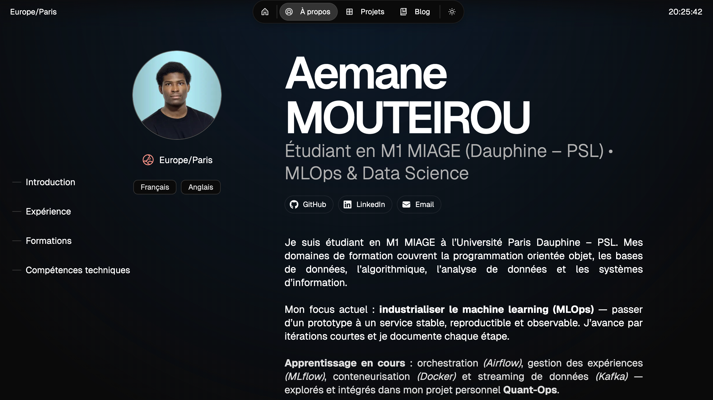

# Mon Portfolio — Next.js x Once UI

Ce dépôt contient le code source de mon **portfolio personnel**, conçu avec [Next.js](https://nextjs.org) et [Once UI](https://once-ui.com).  
Le site présente mes **projets techniques**, mes **articles** et mon **parcours académique et professionnel**.

---

## Aperçu

- **Nom de domaine** : [dpmaine.fr](https://www.aemanemouteirou.com/)  
- **Technologies principales** : Next.js · React · MDX · Once UI  
- **Déploiement continu** : Cloudflare Pages + GitHub Actions  



---

## Installation locale

### 1. Cloner le dépôt
```bash
git clone https://github.com/aemane-m/mon-portfolio.git
cd mon-portfolio
````

### 2. Installer les dépendances

```bash
npm install
```

### 3. Lancer le serveur de développement

```bash
npm run dev
```

Le site sera accessible sur [http://localhost:3000](http://localhost:3000)

---

## 🧩 Structure du projet

### Contenu et configuration

* **Configuration principale** : `src/resources/once-ui.config.js`
* **Contenus** (texte, liens, réseaux, pages actives) : `src/resources/content.js`

### Articles et projets

* **Articles de blog** : `src/app/blog/posts/*.mdx`
* **Projets** : `src/app/work/projects/*.mdx`

Chaque page est écrite en **MDX**, ce qui permet de mélanger du markdown et des composants React.

---

## Déploiement

Le portfolio est déployé automatiquement via **Cloudflare Pages**.
Chaque *push* sur la branche `main` déclenche un **workflow GitHub Actions** qui :

1. reconstruit l’application en mode production
2. déploie la nouvelle version sur le domaine `aemanemouteirou.com`

---

## Sécurité et confidentialité

Ce portfolio est **privé** et hébergé sur un domaine personnel.
Certaines sections (ex. projets internes ou documents professionnels) peuvent être protégées ou rendues inaccessibles au public.

---

## Auteur

Développé par **Aemane MOUTEIROU**

* [LinkedIn](https://www.linkedin.com/in/aemane)
* [GitHub](https://github.com/aemane-m)

---

## 📜 Licence

Ce projet est basé sur le template [Magic Portfolio](https://github.com/once-ui-system/magic-portfolio),
distribué sous licence **Creative Commons Attribution-NonCommercial 4.0 International (CC BY-NC 4.0)**.
